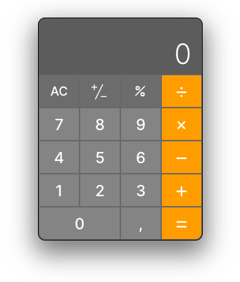

# Calculator App

A simple and interactive calculator application built using React. This app supports basic arithmetic operations, percentage calculations, and toggling between positive and negative numbers.



## Features

- Basic arithmetic operations: addition, subtraction, multiplication, and division.
- Percentage calculations.
- Toggle between positive and negative numbers.
- Clear functionality to reset the input and expression.

## How to Run

### Prerequisites

Ensure you have the following installed:

- Node.js (https://nodejs.org)
- npm (Node package manager, comes with Node.js)

### Installation

1. Clone the repository:

    ```sh
    git clone https://github.com/semenets/calculator
    cd calculator
    ```

2. Install the dependencies:

    ```sh
    npm install
    ```

### Running the App

1. Start the development server:

    ```sh
    npm start
    ```

2. Open your browser and navigate to `http://localhost:3000` to see the calculator in action.

### Build for Production

To create an optimized build of the app for production:

```sh
npm run build
